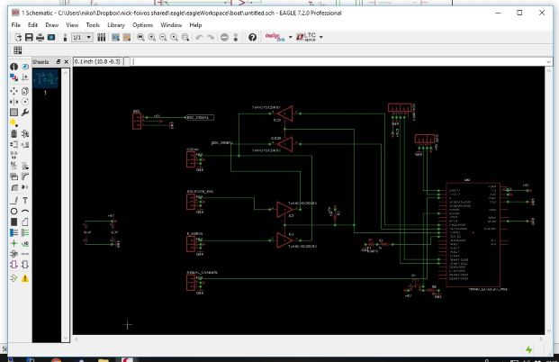
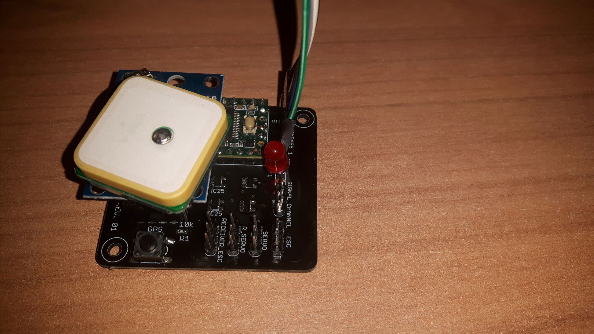
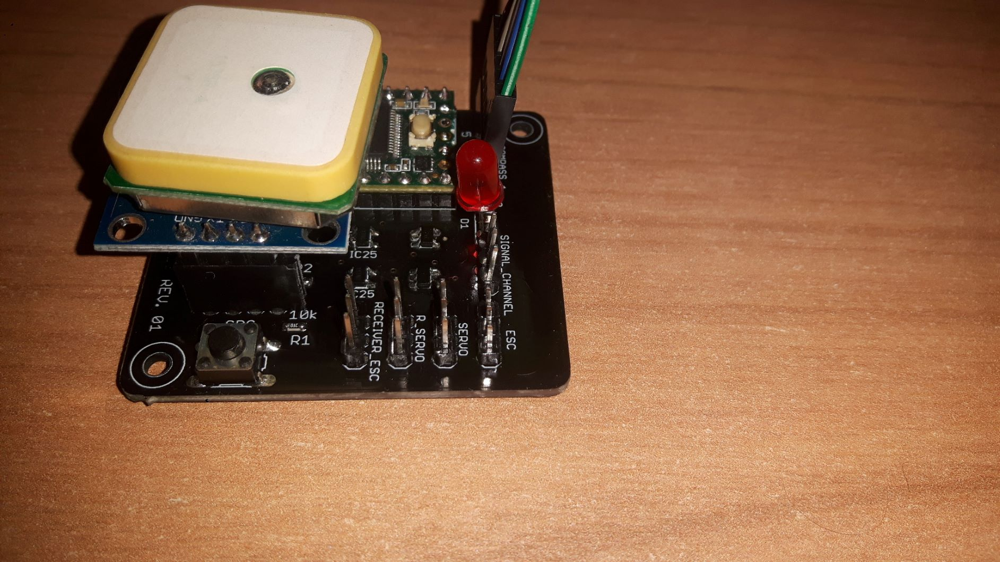

# Rc-boat-gps-robot

I made this device to install it on my RC boat model, it can detect the loss of the signal from the transmitter (usually if the boat go out of range) and takes the control of the boat 
to return it back to the shore. I used a teensy microcontroller , a digital compass HMC5883 and a GPS module NEO-6M. I designed the electronic circuit and i wrote the code in C language so all of these can work together. If you scroll down you will find some pictures with the progress of the project.

